# SkillSnap


SkillSnap is a peer-to-peer skill-sharing application built with Flutter, designed to empower users to exchange knowledge in an interactive and engaging way. The platform enables real-time skill sharing through chats, video calls, and live sessions, allowing users to use knowledge itself as a form of currency. Beyond direct exchanges, SkillSnap enhances learning by recommending online courses tailored to users' skill sets, offering daily problem-solving challenges, and providing tools to track progress and showcase skills in a structured portfolio format.

---

## 🚀 Features

- 📸 Capture and showcase your skills  
- 🗂️ Organize skills into categories for better presentation share learning materials with the users u exchanged skills with 
- 🔍 Easy navigation and clean UI for enhanced usability  
- ☁️ Fin suitable match to exchange skills,real time chats and video calls  
- 📱 Built with **Flutter** for cross-platform support (Android & iOS)

---

## 📸 App Screenshots

### Home & Navigation


<div align="center" style="display: flex; justify-content: center; gap: 30px; margin-bottom: 40px;">
  
  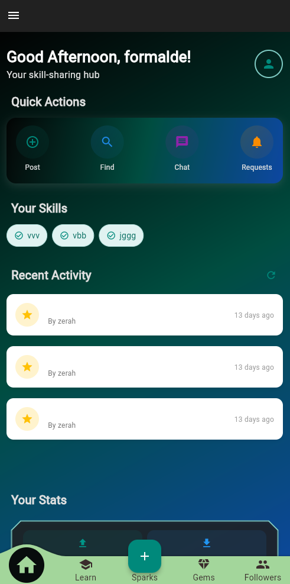
  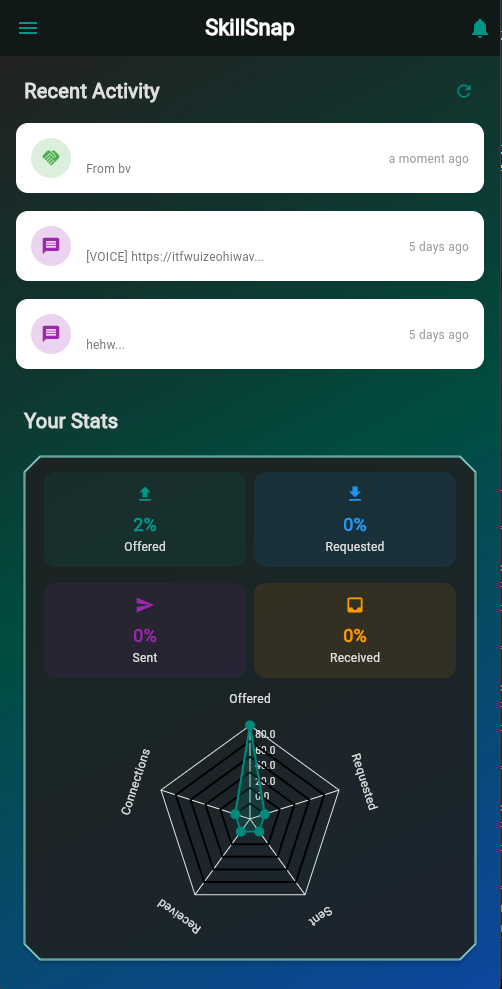
  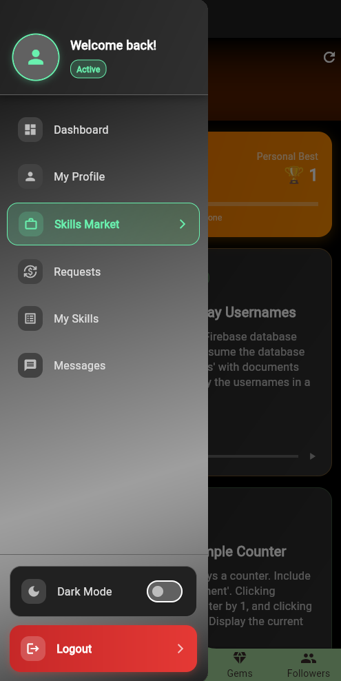
</div>

### Skill Management
<div align="center" style="display: flex; justify-content: center; gap: 20px; margin-bottom: 40px;">
  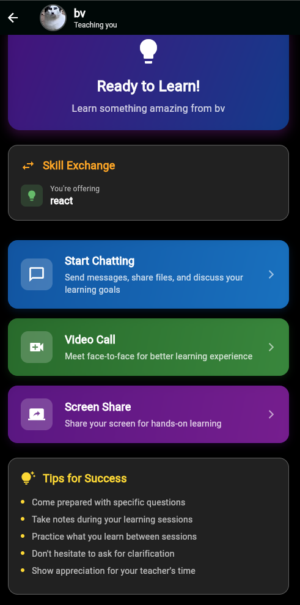
  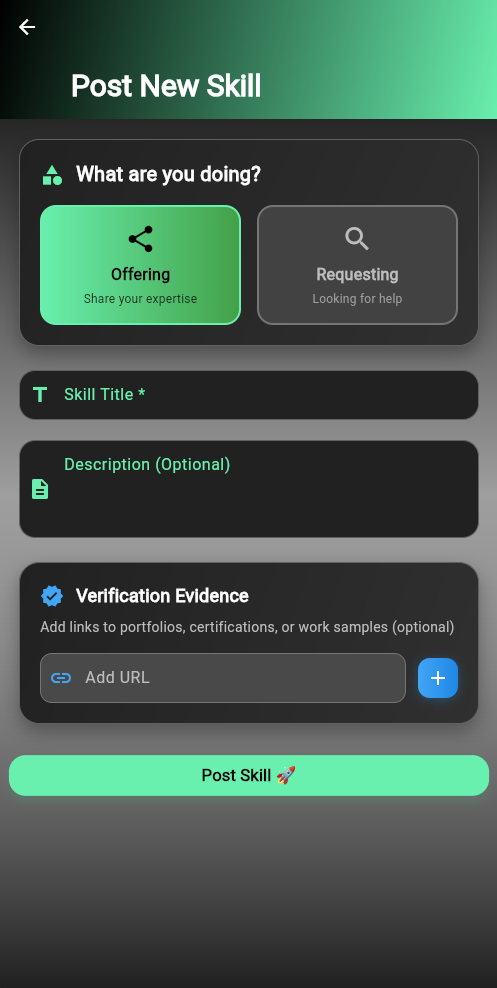
  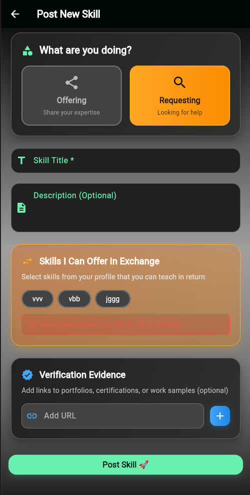
</div>

### Portfolio Views
<div align="center" style="display: flex; justify-content: center; gap: 20px; margin-bottom: 40px;">
  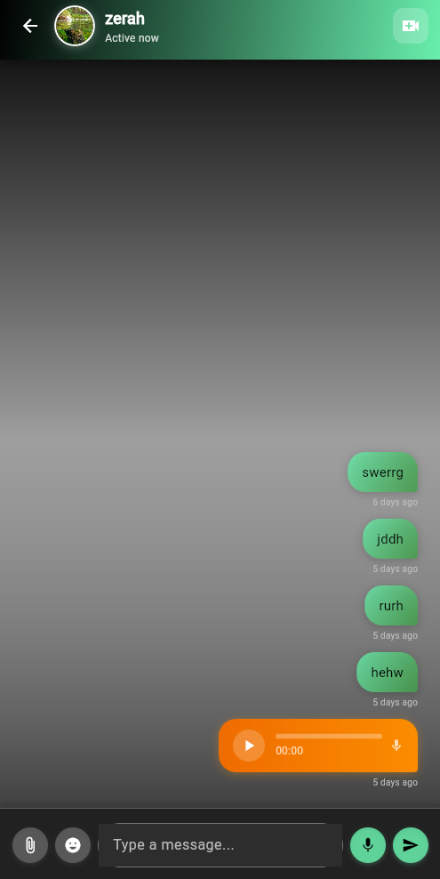
  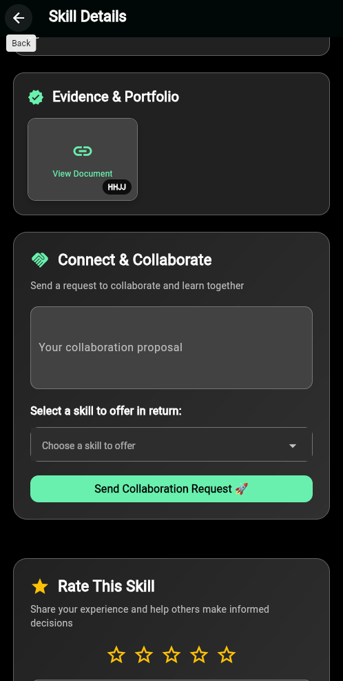
  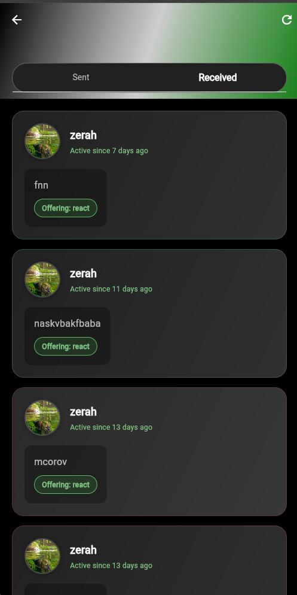
</div>

### Sharing & Profiles
<div align="center" style="display: flex; justify-content: center; gap: 20px; margin-bottom: 40px;">
  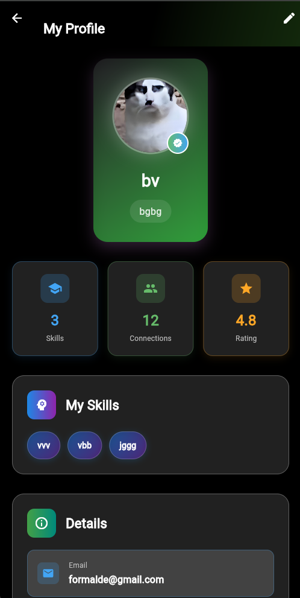
  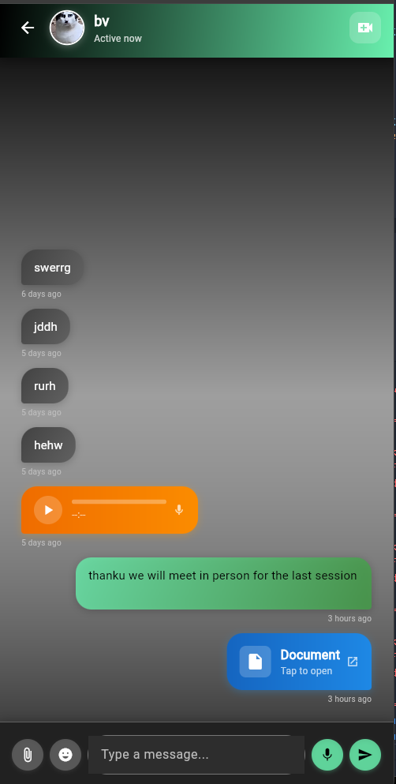
  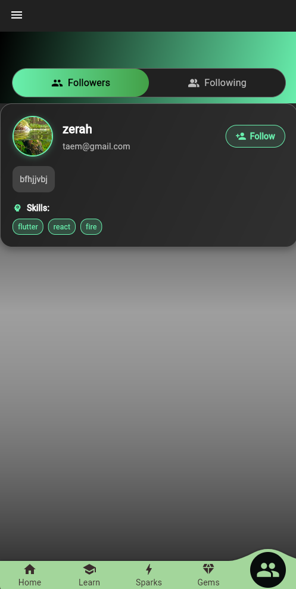
</div>

### Additional Features
<div align="center" style="display: flex; justify-content: center; gap: 20px; margin-bottom: 40px;">
  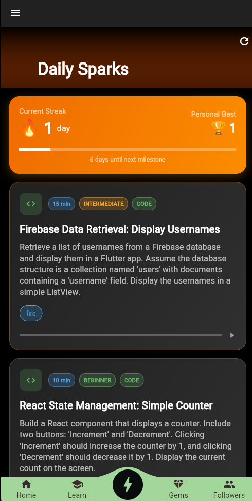
  
  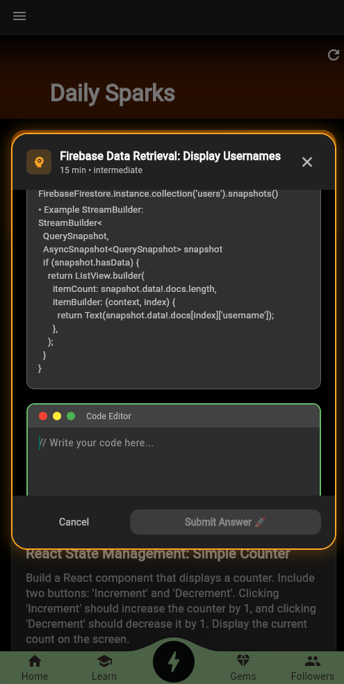
</div>

---

## 🛠️ Tech Stack

| Tool / Framework | 
|------------------|
| Flutter          | 
| Dart             | 
| Supabase         |
| Android/iOS SDK  |
| Gemini AI        |

---

## 📦 Installation

1. **Clone the repository**
   ```bash
   git clone https://github.com/TAEMZ/SkillSnap.git
   cd SkillSnap
